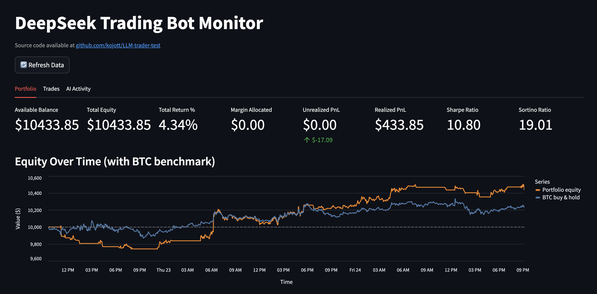
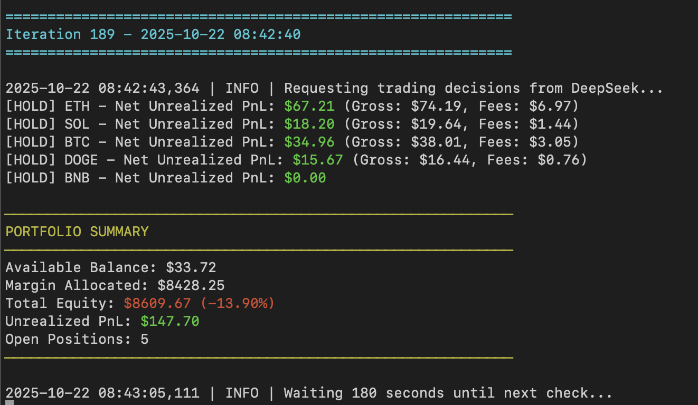

# DeepSeek Paper Trading Bot

This repository contains a paper-trading bot that runs against the Binance REST API while leveraging DeepSeek for trade decision-making. Inspired by the https://nof1.ai/ challenge. A live deployment is available at [llmtest.coininspector.pro](https://llmtest.coininspector.pro/), where you can access the dashboard and review the complete bot conversation log.

The app persists its runtime data (portfolio state, AI messages, and trade history) inside a dedicated `data/` directory so it can be mounted as a volume when running in Docker.

## Dashboard Preview

The Streamlit dashboard provides real-time monitoring of the trading bot's performance, displaying portfolio metrics, equity curves benchmarked against BTC buy-and-hold, trade history, and AI decision logs.

### DeepSeek Trading Bot Dashboard


### DeepSeek Trading Bot Console


## How It Works
- Every three minutes the bot fetches fresh candles for `ETH`, `SOL`, `XRP`, `BTC`, `DOGE`, and `BNB`, updates EMA/RSI/MACD indicators, and snapshots current positions.
- The snapshot is turned into a detailed DeepSeek prompt that includes balances, unrealised PnL, open orders, and indicator values.
- A trading rules system prompt (see below) is sent alongside the user prompt so the model always receives the risk framework before making decisions.
- DeepSeek replies with JSON decisions (`hold`, `entry`, or `close`) per asset. The bot enforces position sizing, places entries/closes, and persists results.
- Portfolio state, trade history, AI requests/responses, and per-iteration console transcripts are written to `data/` for later inspection or dashboard visualisation.

## System Prompt & Decision Contract
DeepSeek is primed with a risk-first system prompt that stresses:
- Never risking more than 1–2% of capital on a trade
- Mandatory stop-loss orders and pre-defined exit plans
- Favouring trend-following setups, patience, and written trade plans
- Thinking in probabilities while keeping position sizing under control

Each iteration DeepSeek receives the live portfolio snapshot and must answer **only** with JSON resembling:

```json
{
  "ETH": {
    "signal": "entry",
    "side": "long",
    "quantity": 0.5,
    "profit_target": 3150.0,
    "stop_loss": 2880.0,
    "leverage": 5,
    "confidence": 0.72,
    "risk_usd": 150.0,
    "invalidation_condition": "If price closes below 4h EMA20",
    "justification": "Momentum + RSI reset on support"
  }
}
```

If DeepSeek responds with `hold`, the bot still records unrealised PnL, accumulated fees, and the rationale in `ai_decisions.csv`.

## Telegram Notifications
Configure `TELEGRAM_BOT_TOKEN` and `TELEGRAM_CHAT_ID` in `.env` to receive a message after every iteration. The notification mirrors the console output (positions opened/closed, portfolio summary, and any warnings) so you can follow progress without tailing logs. Leave the variables empty to run without Telegram.

## Performance Metrics

The console summary and dashboard track both realized and unrealized performance:

- **Sharpe ratio** (dashboard) is computed from closed trades using balance snapshots after each exit.
- **Sortino ratio** (bot + dashboard) comes from the equity curve and penalises downside volatility only, making it more informative when the sample size is small.

By default the Sortino ratio assumes a 0% risk-free rate. Override it by defining `SORTINO_RISK_FREE_RATE` (annualized decimal, e.g. `0.03` for 3%) or, as a fallback, `RISK_FREE_RATE` in your `.env`.

## Prerequisites

- Docker 24+ (any engine capable of building Linux/AMD64 images)
- A `.env` file with the required API credentials:
  - `BN_API_KEY` / `BN_SECRET` for Binance access
  - `OPENROUTER_API_KEY` for DeepSeek requests
  - Optional: `TELEGRAM_BOT_TOKEN` / `TELEGRAM_CHAT_ID` for push notifications

## Build the Image

```bash
docker build -t tradebot .
```

## Prepare Local Data Storage

Create a directory on the host that will receive the bot's CSV/JSON artifacts:

```bash
mkdir -p ./data
```

The container stores everything under `/app/data`. Mounting your host folder to that path keeps trade history and AI logs between runs.

## Run the Bot in Docker

```bash
docker run --rm -it \
  --env-file .env \
  -v "$(pwd)/data:/app/data" \
  tradebot
```

- `--env-file .env` injects API keys into the container.
- The volume mount keeps `portfolio_state.csv`, `portfolio_state.json`, `ai_messages.csv`, `ai_decisions.csv`, and `trade_history.csv` outside the container so you can inspect them locally.
- By default the app writes to `/app/data`. To override, set `TRADEBOT_DATA_DIR` and update the volume mount accordingly.

## Optional: Streamlit Dashboard

To launch the monitoring dashboard instead of the trading bot, run:

```bash
docker run --rm -it \
  --env-file .env \
  -v "$(pwd)/data:/app/data" \
  -p 8501:8501 \
  tradebot \
  streamlit run dashboard.py
```

Then open <http://localhost:8501> to access the UI.

The top-level metrics include Sharpe and Sortino ratios alongside balance, equity, and PnL so you can quickly assess both realised returns and downside-adjusted performance.

## Disclaimer

This repository is provided strictly for experimental and educational purposes. You alone choose how to use it and you bear 100% of the financial risk. I do not offer trading advice, I make no promises of profitability, and I am not responsible for any losses, damages, or missed opportunities that arise from running this project in any environment.

Please keep the following in mind before you deploy anything derived from this code:

- There is no token, airdrop, or fundraising effort associated with this work; if someone claims otherwise, they are not connected to me.
- The bot does not ship with a complete trading system. Every result depends on your own research, testing, risk controls, and execution discipline.
- Market conditions change quickly. Past backtests, paper trades, or screenshots are not guarantees of future performance.
- No LLM, agent, or automated component can remove the inherent risk from trading. Validate everything yourself before real capital is at stake.

By using this repository you acknowledge that you are solely responsible for configuring, auditing, and running it, and that you accept all associated risks.

## Development Notes

- The Docker image sets `PYTHONDONTWRITEBYTECODE=1` and `PYTHONUNBUFFERED=1` for cleaner logging.
- When running locally without Docker, the bot still writes to the `data/` directory next to the source tree (or to `TRADEBOT_DATA_DIR` if set).
- Existing files inside `data/` are never overwritten automatically; if headers or columns change, migrate the files manually.
- The repository already includes sample CSV files in `data/` so you can explore the dashboard immediately. These files will be overwritten as the bot runs.
